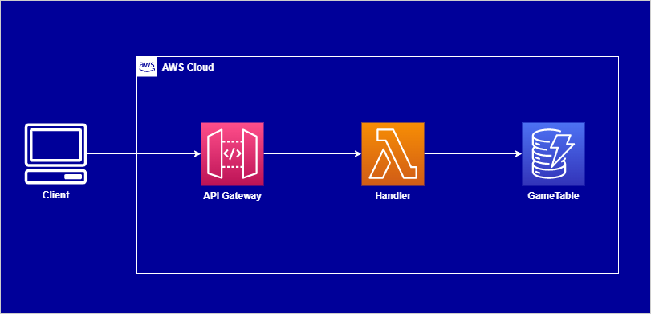

# DynamoDB Game

Progetto utilizzato nel webinar **Come modellare e interrogare i dati in DynamoDB: JOIN no grazie!** su [Codemotion](https://www.codemotion.com/).

Per l'implementazione è stato utilizzato il framework [serverless](https://www.serverless.com/).

## Architettura


## Setup ambiente locale

Clonare il repository e spostarsi nella cartella `dynamodb-game`; eseguire:

```bash
npm install

# Eseguire le seguenti modifiche:
#
# Manually editing the download_url in node_modules/dynamodb-localhost/dynamodb/config.json to
# https://s3.us-west-2.amazonaws.com/dynamodb-local/dynamodb_local_latest.tar.gz
# and the import of http to https
# in node_modules/dynamodb-localhost/dynamodb/installer.js
#
# e poi
sls dynamodb install
```

### Esecuzione offline

Per eseguire DynamoDB local occorre aver installato una versione recente di Java;
si consiglia [Amazon Corretto](https://aws.amazon.com/it/corretto/).

```bash
sls offline start --stage local
```

Nella cartella `docs/postman` è presente la collezione postman per invocare l'API.
