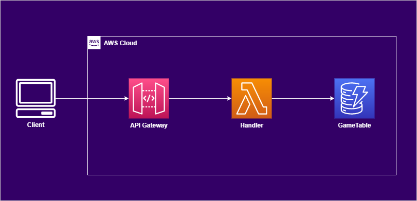

# :video_game: DynamoDB Game

Progetto che accompagna il webinar  
[**Come modellare e interrogare i dati in DynamoDB: JOIN no grazie!**](https://events.codemotion.com/webinars/come-modellare-e-interrogare-i-dati-in-dynamodb-join-no-grazie).

Per l'implementazione è stato utilizzato il framework   [serverless](https://www.serverless.com/)  e NodeJS v18.14.2

## :office: Architettura


## :computer: Setup ambiente locale

Clonare il repository e spostarsi nella cartella `dynamodb-game`; eseguire:

```bash
npm install
```


:warning: Modificare 
* il download_url nel file `node_modules/dynamodb-localhost/dynamodb/config.json` in  
`https://s3.us-west-2.amazonaws.com/dynamodb-local/dynamodb_local_latest.tar.gz`
* l'import http in https
nel file `node_modules/dynamodb-localhost/dynamodb/installer.js`

poi eseguire

```bash
sls dynamodb install
```

### Esecuzione offline

:warning: Per eseguire DynamoDB local occorre aver installato una versione recente di Java;
si consiglia [Amazon Corretto](https://aws.amazon.com/it/corretto/).

```bash
# Avvia DynamoDB local e l'HTTP Server che gestisce le richieste.
# Viene anche creata la tabella GameTable definita in serverless.yml.
sls offline start --stage local
```

Nella cartella `docs/postman` è presente la collezione postman per invocare l'API.

## :eyes: Per approfondire...

* [AWS re:Invent 2020: Data modeling with Amazon DynamoDB](https://www.youtube.com/watch?v=fiP2e-g-r4g)
* [DynamoDB Developer Guide](https://docs.aws.amazon.com/amazondynamodb/latest/developerguide)
* [DynamoDB Guide by Alex DeBrie](https://www.dynamodbguide.com/)
* [AWS DynamoDB Workshop](https://amazon-dynamodb-labs.workshop.aws/)
* [Advanced DynamoDB Patterns](https://www.youtube.com/watch?v=Q6-qWdsa8a4&t=7s)

